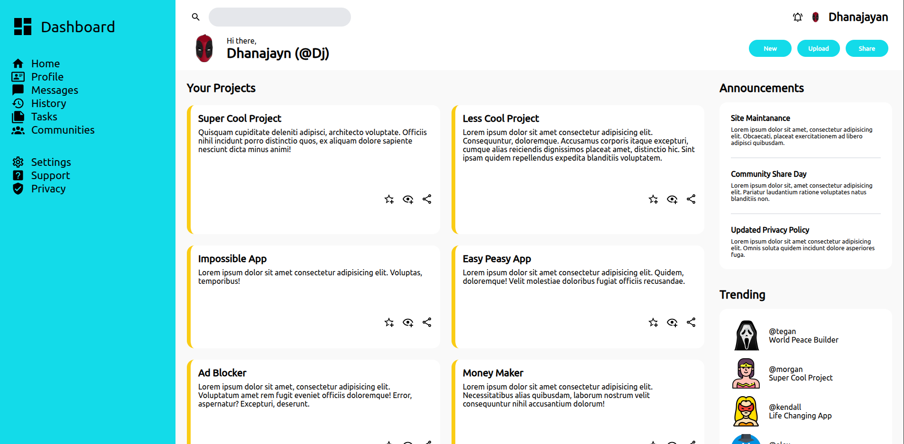

# odin-admin-dashboard



This project is part of The Odin Project’s Intermediate HTML and CSS Course, created to practice CSS Grid, Flexbox, and responsive layouts by building an admin dashboard.

## Project Overview

The odin-admin-dashboard is a modern web-based admin panel layout.  
It replicates a typical dashboard interface with sidebar navigation, a top header, project cards, announcements, and trending sections.  
This project helped me strengthen my understanding of CSS Grid, layout composition, and UI structuring.

## Features

- Responsive admin dashboard with sidebar, header, and content sections.
- CSS Grid + Flexbox for clean and adaptable layouts.
- Hover effects for interactive sidebar navigation.
- Content cards for projects, announcements, and trending users.
- Designed with a consistent visual style and reusable components.

## Usage

To try out the odin-admin-dashboard application, follow these steps:

1. Visit the [Live Demo](https://dhanajayan-04.github.io/odin-admin-dashboard/) to view it directly in your browser.

2. Alternatively, clone this repository and open the `index.html` file in your browser.

## Development

To work on this project locally or further customize it:

1. Clone this repository:
   ```bash
   git clone https://github.com/Dhanajayan-04/odin-admin-dashboard.git

## Acknowledgments

- This project was created as part of The Odin Project's Foundation Course.
- Special thanks to the open-source community for providing resources and inspiration.